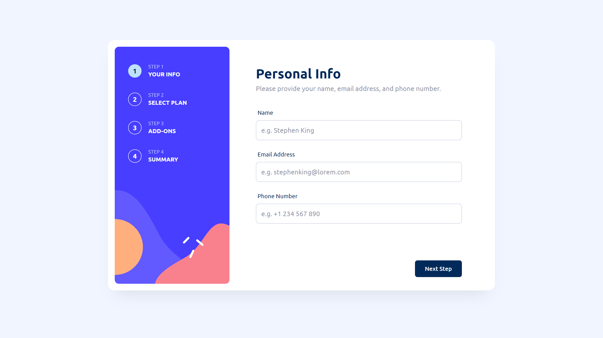
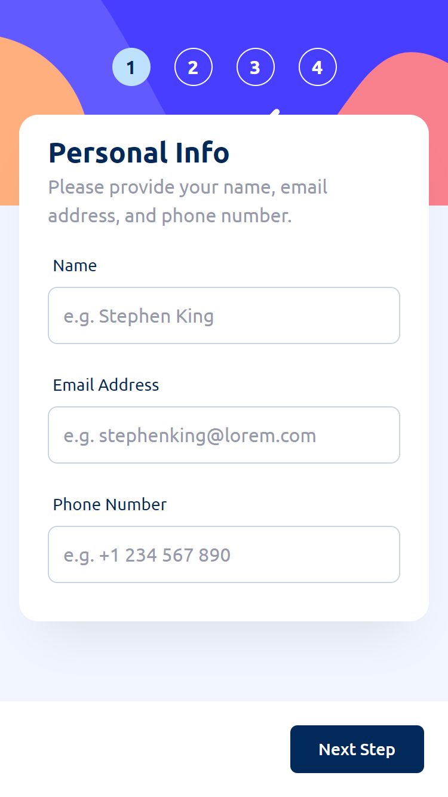

# Frontend Mentor - Multi-step form solution

This is a solution to the [Multi-step form challenge on Frontend Mentor](https://www.frontendmentor.io/challenges/multistep-form-YVAnSdqQBJ).

## Table of contents

- [Overview](#overview)
  - [The challenge](#the-challenge)
  - [Screenshot](#screenshot)
  - [Links](#links)
- [My process](#my-process)
  - [Built with](#built-with)
- [Author](#author)

## Overview

### The challenge

Users should be able to:

- Complete each step of the sequence
- Go back to a previous step to update their selections
- See a summary of their selections on the final step and confirm their order
- View the optimal layout for the interface depending on their device's screen size
- See hover and focus states for all interactive elements on the page
- Receive form validation messages if:
  - A field has been missed
  - The email address is not formatted correctly
  - A step is submitted, but no selection has been made

### Screenshot

### Links

- [Solution URL](https://www.frontendmentor.io/solutions/multi-step-form-using-react-n35o40_iO7)
- [Live Site URL](https://omar-elmassry.github.io/multi-step-form/)

## My process

### Built with

- Semantic HTML5 markup
- CSS custom properties
- Flexbox
- CSS Grid
- Mobile-first workflow
- [React](https://reactjs.org/) - JS library
- [TypeScript](https://www.typescriptlang.org/) - Types for JS
- [tailwindcss](https://tailwindcss.com/) - For styles
- [react-hook-form](https://react-hook-form.com/) - For managing forms
- [Framer Motion](https://www.framer.com/motion/) - Animation library
- [Zod](https://zod.dev/) - Schema validation library

## Author

- Frontend Mentor - [@Omar-Elmassry](https://www.frontendmentor.io/profile/Omar-Elmassry)
